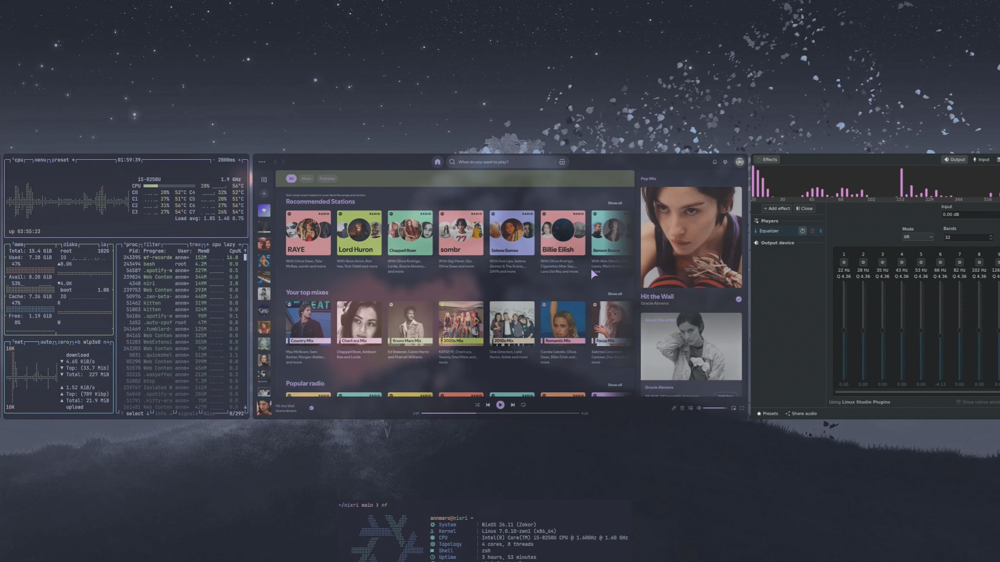
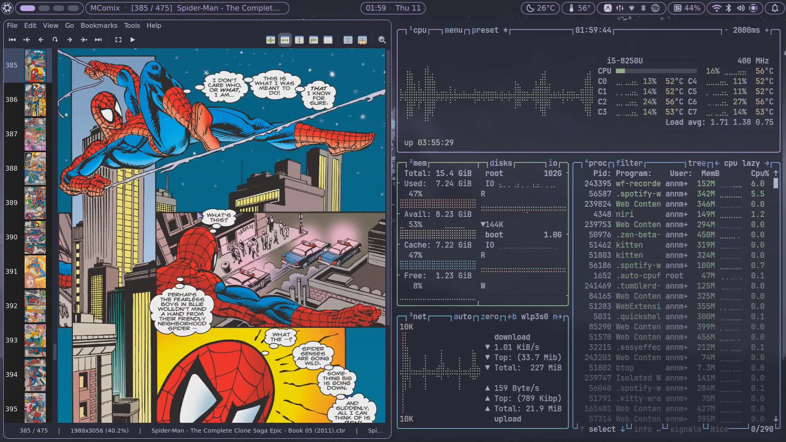
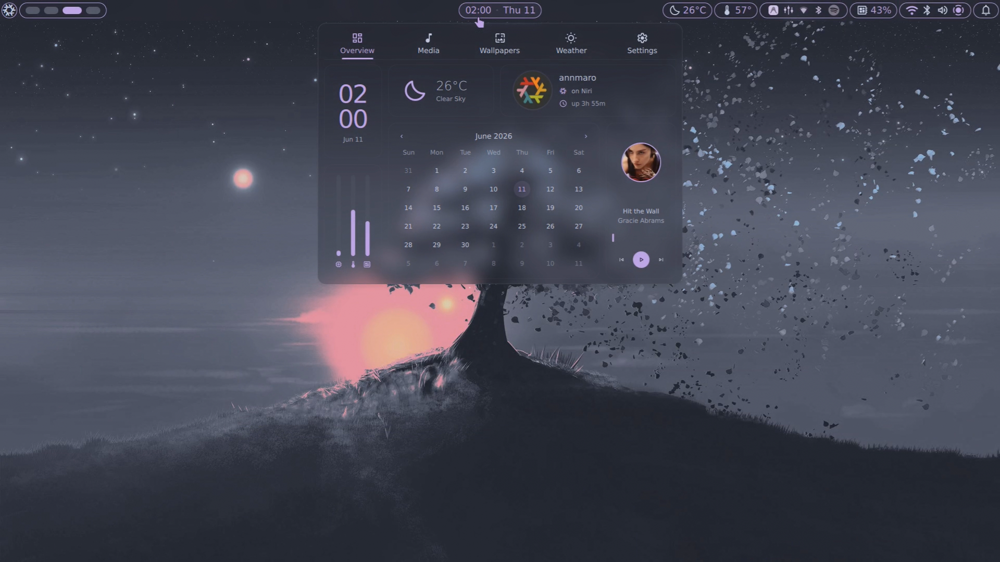
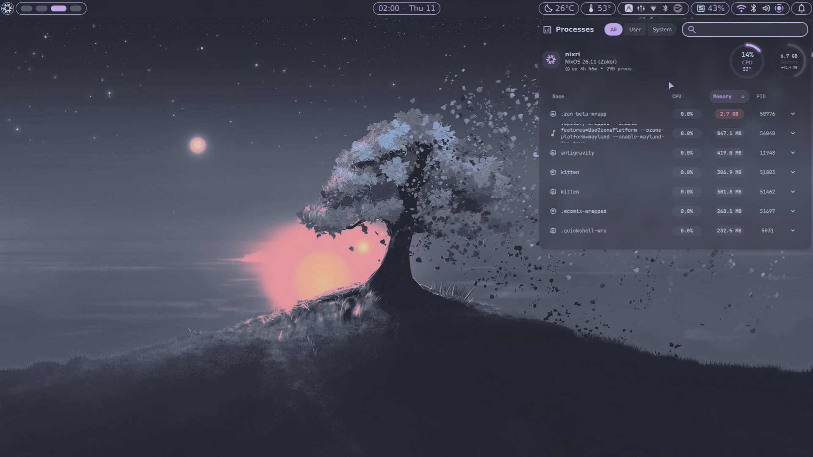
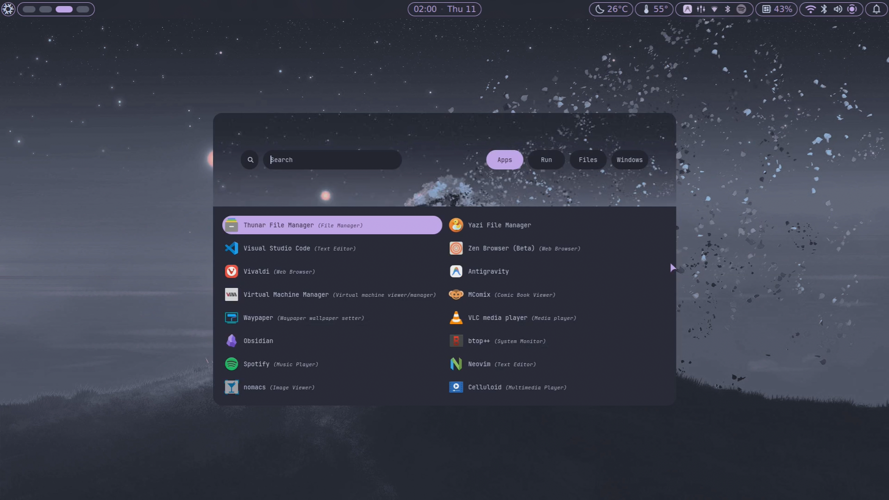
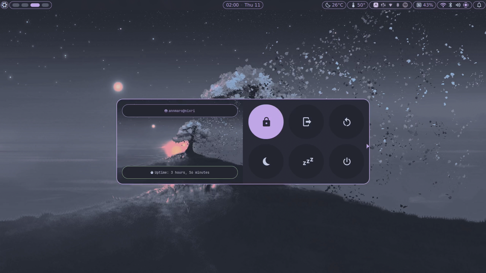
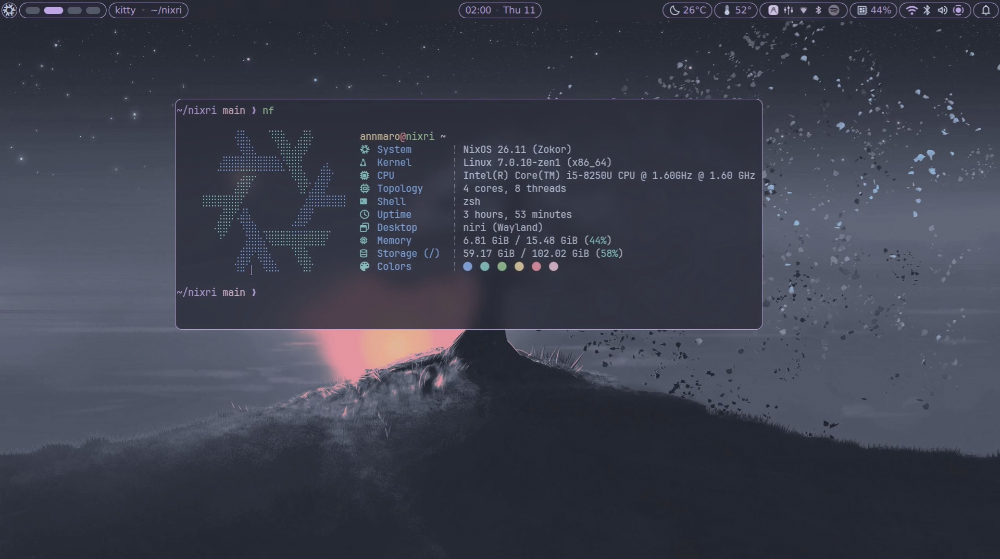

<!-- markdownlint-disable MD033 -->
<div align="center">
    
   <br>
   <h1>My NixOS Configuration</h1> 
   <br>
   
   <br>
   <br>
   <p>
      <a href="https://github.com/annmaro/nixri/stargazers">
         
      </a>
      <a href="https://github.com/annmaro/nixri/network/members">
         
      </a>
      <a href="https://nixos.org">
         
      </a>
      <a href="https://github.com/annmaro/nixri/blob/main/LICENSE">
         
      </a>
   </p>
</div>

<h3 align="center">Watch the demo video on YouTube</h3>

<p align="center">
  <a href="https://youtu.be/K9vDWjv49Ck">
    
  </a>
</p>

## Screenshots





<details>
<summary>More screenshots</summary>






</details>

## Table of Contents

- [Screenshots](#screenshots)
- [Table of Contents](#table-of-contents)
- [Installation](#installation)
  - [Installation Steps](#installation-steps)
  - [Rebuilding](#rebuilding)
  - [Rollbacks](#rollbacks)
  - [Keybindings](#keybindings)
- [Credits/Inspiration](#creditsinspiration)

## Installation

> [!Note]
> Before proceeding with the installation, check these files and adjust them for your system:
>
> - `hosts/default/variables.nix`: Contains host-specific variables.
> - `hosts/default/host-packages.nix`: Lists installed packages for the host.
> - `hosts/default/configuration.nix`: Module imports for the host and extra configuration.
> - `modules/core/packages/`: Contains the list of packages to be installed.
> - `modules/hardware/drives/`: Optional fstab-style mounts for extra volumes (e.g. games/work).


You can also check the [Production Docs](https://annmaro.github.io/nixri) for a better understanding of the entire NixOS setup.

This flake is designed for a minimal install of nixos. install nixos first, then follow the instructions below.

### Installation Steps

**Method 1: Automatic**

1. Clone the Repository:

```bash
git clone https://github.com/annmaro/nixri.git ~/nixri
```

2. Change Directory:

```bash
cd ~/nixri
```

3. Run the Installer:

```bash
nix run .#installer --extra-experimental-features "nix-command flakes"
```

The install and rebuild scripts automate the setup process, including hosts, username, and applying the configuration. It also automatically generates the hardware-configuration.nix file based on your system's detected hardware, eliminating the need to manually generate it.

**Method 2: Manual:**

1. Copy `hosts/default` to a new directory (e.g., `hosts/Laptop`)
2. Edit the new host's `variables.nix`, `core packages` and `host-packages.nix`
3. Add the host to `flake.nix`:

4. Rebuild with the new hostname using either `nixos-rebuild` or `nh` (see [Rebuilding](#rebuilding) below). Once rebuilt, any rebuilding method can be used, as the host name will be implicitly recognised.

### Rebuilding

Apply configuration changes:

- **nixos-rebuild:** `sudo nixos-rebuild switch --flake ~/nixri#<HOST>`
- **nh:** `nh os switch --hostname <HOST>`

Replace `<HOST>` with the name of your host (e.g., `Laptop`).

> [!Note]
>
> - If you face any error during the rebuilding phase, kindly uncomment the neovim config from the configuration.nix file. Once you have successfully booted into NixOS, you can add neovim.

### Rollbacks

List generations:

```bash
list-gens
```

Rollback to generation N:

```bash
rollback N
```

Replace `N` with the generation number (e.g., `69`).

### Keybindings

View all keybindings with `Super + Shift + K`.

## Credits/Inspiration

| Credit                                             | Reason                                      |
| -------------------------------------------------- | ------------------------------------------- |
| [Sly-Harvey](//github.com/Sly-Harvey/NixOS)        | Thanks for creating such a wonderful config |
| [Nixy](https://github.com/anotherhadi/nixy)        | Amazing Neovim config                       |
| [Rofi-adi1090x ](https://github.com/adi1090x/rofi) | Rofi custom launcher & powermenu            |

